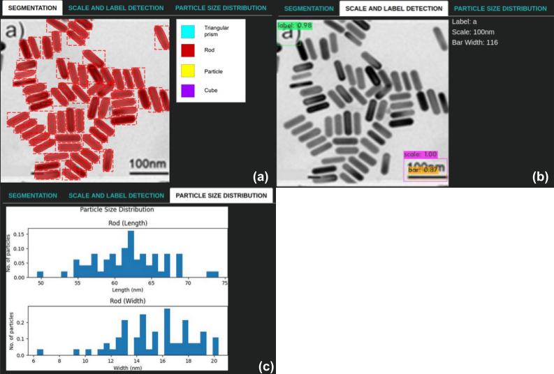

# Setup Instructions

## Model Weights
1) Download [SRCNN weights](https://drive.google.com/file/d/1zmBxzC9SVJm9vciOPLbKzVIVlH09UZtW/view?usp=sharing) and place it in `server/label_scale_bar_detector/OCR/SRCNN-pytorch/weights/`.
2) Download [Darknet weights](https://drive.google.com/file/d/1CR0chidAN8x7LLWcLHYz4QR7pHfsQB8-/view?usp=sharing) and place it in `server/label_scale_bar_detector/localizer/darknet/backup`.
3) Download [Mask RCNN weights](https://drive.google.com/file/d/1JwXbYScYNlds5g5JHFwEZLwI5eShyaj4/view?usp=sharing) and place it in `server/Mask_RCNN/logs/tem`.

## Installation

Run `conda env create -f environment.yml`.
Note: Installation using this yml file has been tested only on MACOSX.

# Running the app

1) `export CORS_DEBUG="True"`
2) `cd client && npm start`.
3) `cd server && uvicorn main:app --reload`.  

The following is an illustration of the results displayed when a sample TEM image is uploaded.  
  

# Acknowledgements

1) [https://github.com/AlexeyAB/darknet](https://github.com/AlexeyAB/darknet)
2) [https://github.com/yjn870/SRCNN-pytorch](https://github.com/yjn870/SRCNN-pytorch)
3) [https://github.com/matterport/Mask_RCNN](https://github.com/matterport/Mask_RCNN)
